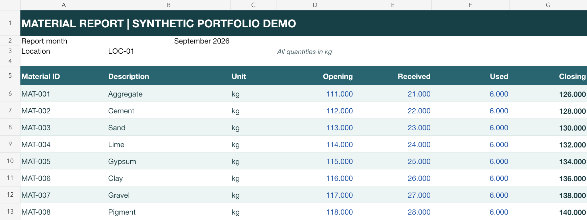
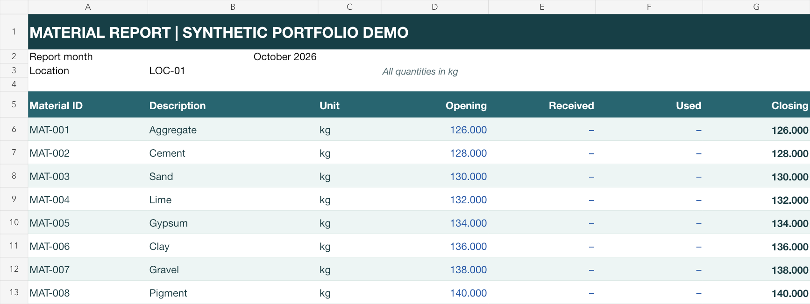

# Monthly report automation

Roll a folder of monthly Excel material reports into next month's opening reports, with validation before any output is published.

**Independent portfolio project by William Palmisano, developed with AI assistance.** All example data is synthetic. This demonstrates a defined workflow; it is not a completed client contract or a claim that unseen spreadsheets are supported.

## See the result

The included demonstration processes **12 location reports and 96 material records**. Each closing balance becomes the next month's opening balance, receipts and usage reset to zero, and the workbook's formulas and supported formatting remain in place.

For `LOC-01 / MAT-001` (Aggregate, kg):

| Field | September 2026 input | October 2026 output |
|---|---:|---:|
| Opening | 111 | 126 |
| Received | 21 | 0 |
| Used | 6 | 0 |
| Closing, `Opening + Received - Used` | 126 | 126 |

Inspect [the input workbook](examples/input/location-01.xlsx), [the resulting workbook](examples/output/location-01.xlsx), or [the CSV audit trail](examples/output/rollover-summary.csv). Read the [case study](docs/case-study.md) for the reasoning and verification.

### Before



### After



These previews were rendered from the included workbooks with a separate spreadsheet rendering engine; they are not screenshots of Microsoft Excel.

## Run it

Requires Python 3.11 or newer. From the repository directory:

```sh
python3 -m venv .venv
source .venv/bin/activate
python -m pip install -e '.[dev]'
python -m pytest -q
python -m report_rollover.samples --output demo
report-rollover --input demo/input --output demo/output
```

On Windows PowerShell, activate with `.venv\Scripts\Activate.ps1` instead. Windows is not yet verified.

The first command that generates data creates `demo/input/` and `demo/invalid/`. The rollover creates `demo/output/`, containing the next-month workbooks and `rollover-summary.csv`. Neither command overwrites an existing destination. To rerun, choose a new destination:

```sh
report-rollover --input demo/input --output demo/output-second-run
```

The output parent must already exist. The output itself must not exist and cannot be inside the input directory. One writer is assumed: do not edit source files or mutate destination paths during a run. This tool is not a concurrent job scheduler.

## Try a failure

```sh
report-rollover --input demo/invalid --output demo/rejected-output
```

This deliberately exits with code 2 and reports:

```text
Validation error: Batch validation failed:
duplicate-id.xlsx:A7: duplicate material ID 'MAT-001'
invalid-quantity.xlsx:D6: expected a numeric quantity, not text or a formula
missing-id.xlsx:A6: expected nonempty literal text
```

No `demo/rejected-output/` batch is published. Exit codes are `0` for success, `2` for invalid input or arguments, and `1` for file-operation failures.

## Supported workbook format

Each `.xlsx` file has a `Materials` sheet:

- `B2`: an actual Excel date on the first of the report month, without a time component.
- `B3`: a nonempty location identifier, unique across the batch.
- Row 5: the exact column headings below, in order.
- Row 6 onward: one record per material. Completely blank trailing rows are ignored; incomplete or blank interior rows fail validation.

| Column | Header | Requirement |
|---|---|---|
| A | Material ID | Nonempty literal text, unique within a location |
| B | Description | Nonempty literal text |
| C | Unit | Nonempty literal text |
| D | Opening | Nonnegative number, at most three decimal places |
| E | Received | Nonnegative number, at most three decimal places |
| F | Used | Nonnegative number, at most three decimal places |
| G | Closing | Exactly `=D6+E6-F6` for row 6, adjusted for each subsequent row |

IDs may repeat across locations. Surrounding whitespace is ignored when checking duplicate IDs, but original text is retained. All reports must have the same month. Material rosters can differ between locations; missing material rows cannot be detected without a separately supplied expected roster.

The reader requires a real formula cell, not text that merely looks like a formula. Quantities and calculated balances must fit within 15 significant digits and finite Excel numeric storage; unrepresentable balances are rejected instead of rounded. Each staged workbook is reopened and its saved opening balances are compared with the decimal results before publication.

The reader rejects unsupported closing formulas, text/formulas/booleans in quantity fields, invalid numbers, negative balances, duplicate IDs or locations, and mixed months. Excel lock files beginning with `~$` are ignored. Only `.xlsx` files are selected.

## How it works

1. Validate the whole batch and calculate closing quantities using decimal arithmetic.
2. Load each original workbook with formulas retained and prepare a copy.
3. Advance the month, carry calculated closing into opening, and zero receipts and usage.
4. Save the copies and audit CSV to a temporary sibling directory.
5. Publish that directory only when all writes succeed. Clean up staging after handled failures.

Original files are never saved over. Cell styles, number formats, column widths, merged titles and print settings are preserved for the supported template. The code does not execute macros or formulas supplied by the workbook.

**Formula values:** openpyxl does not calculate formulas. The application calculates only the documented closing expression itself and does not trust cached Excel results. Output workbooks retain their formulas and request recalculation when opened in a spreadsheet application. Previews that rely exclusively on formula caches may show blank closing values until recalculation. The CSV contains the calculated numbers without needing Excel.

**CSV text:** text fields beginning with spreadsheet formula prefixes (`=`, `+`, `-`, `@`, tab, CR or LF) receive a leading apostrophe. This also covers formula prefixes after leading whitespace. CSV consumers that need exact raw identifiers should account for this documented escaping; the workbook text is unchanged.

## Scope and limits

This version handles the documented template. It does not support arbitrary layouts, arbitrary formulas, `.xls` or `.xlsm`, macros, external workbook links, charts, embedded objects, live Google Sheets, automatic scheduling, or merging late corrections into reports people have already edited. Use plain, trusted template workbooks; unsupported objects have no preservation guarantee.

A corrected source is processed into a fresh destination. Before adapting this to a real workflow, inspect an anonymized completed report and desired next-month report, confirm formula and formatting rules, and agree on how late corrections should work. No fixed-price estimate is implied by this demo.

## Development and tests

- `validation.py`: workbook contract and batch validation.
- `rollover.py`: date advancement, output safety, transformation and audit CSV.
- `cli.py`: user-facing commands and exit codes.
- `samples.py`: reproducible synthetic data.

Tests exercise valid and invalid workbooks, December rollover, leap-year February, decimal balances, formatting preservation, unchanged source hashes, unsafe destinations, simulated write failures, CSV escaping, real CLI subprocesses, and all 96 demo records.

Known minor issue: uppercase `.XLSX` filenames are processed correctly, but the CLI success-message count omits them. Use lowercase `.xlsx` names for an accurate displayed count.

The [verification record](docs/verification.md) records actual commands and versions. Native Excel and Google Sheets behavior has not been verified. No client data or credentials are required.
